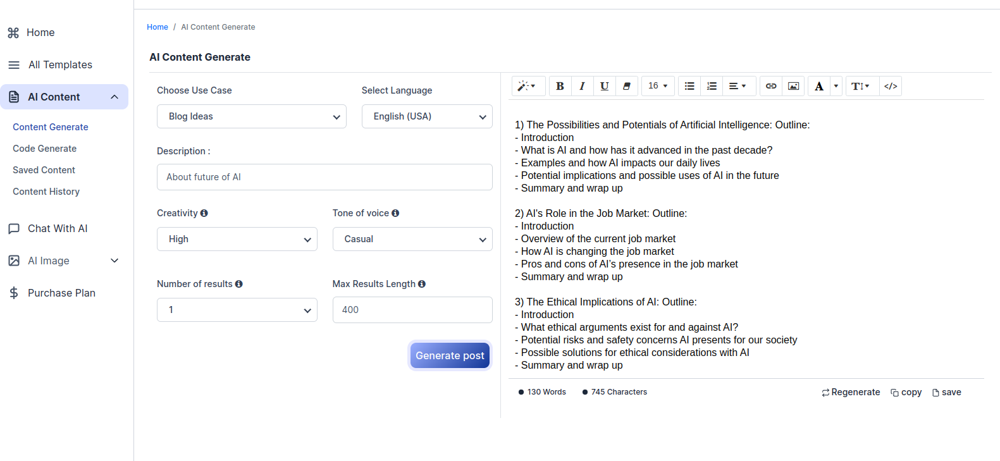
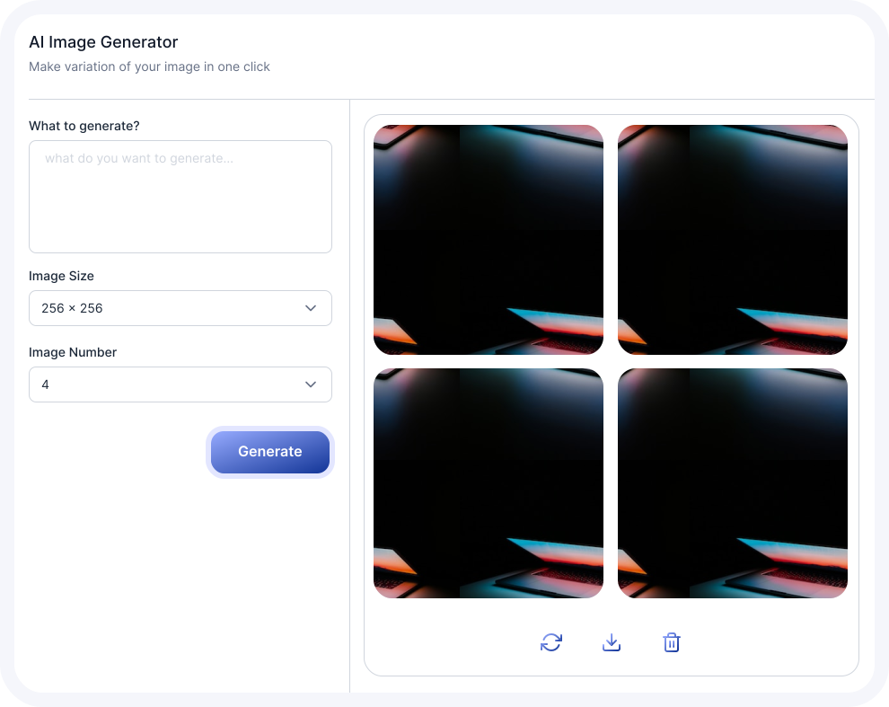

# 🚀 AI Content & Image Generator SaaS  

<div style="display: flex;">
    
    
    
    
    
</div>

An advanced AI-powered SaaS platform that enables users to generate high-quality content, create stunning AI-generated images, and interact with an intelligent chatbot. The platform also supports AI-driven code generation and dynamic use case templates, making it a versatile tool for various industries. Integrated with multiple payment gateways and offering a seamless user experience through PWA and live chat support.

## ✨ Features  

### 📝 AI-Powered Tools  
- **AI Content Generator** – Create high-quality articles, blog posts, and marketing copy with AI-driven assistance.  
- **AI Image Generator** – Generate unique and visually appealing images using AI-based models.  
- **AI Chatbot** – An intelligent chatbot that provides automated responses and enhances user engagement.  
- **AI Code Generator** – Write and debug code with AI-powered suggestions for multiple programming languages.  
- **Dynamic Use Case Templates** – Ready-to-use templates for various industries, making it easy to generate content for specific needs.  

### 💳 Payment Integrations  
- **Stripe** – Secure and globally accepted payment gateway.  
- **Razorpay** – Popular payment solution for businesses in India.  
- **Amar Pay** – A reliable payment gateway for local transactions.  
- **Bank Transfer** – Manual payment option for users who prefer traditional banking methods.  

### 🔥 Additional Features  
- **Tawk.to Chat Integration** – Real-time customer support and live chat to improve user experience.  
- **Progressive Web App (PWA)** – Fast, responsive, and installable on any device for a seamless experience.  
## 🎥 Demo

### AI Content Generator:



### AI Image Generator:




## 📦 Installation

Welcome to the setup guide for the **AI Content Image Generator SAAS**. This document provides comprehensive steps to install, configure, and run the project in your local environment, using both Docker and a native setup. Follow these instructions to ensure proper configuration.

## 📝 Prerequisites

Please ensure you have the following installed on your system:

- **PHP** (version 8.2 or higher)
- **Composer**
- **npm**
- **MySQL** (version 8.0 or compatible, e.g., MariaDB)
- **Git**

## 📈 Server Requirements

This application requires a server with the following specifications:

- **PHP** (version 8.2 or higher) with the extensions:
  - BCMath
  - Ctype
  - Fileinfo
  - JSON
  - Mbstring
  - PDO
  - GD
  - Zip
  - PDO MySQL
- **MySQL** (version 8.0) or **MariaDB**
- **Composer**
- **Web Server**: Apache or Nginx


## ⚙️ Setup Options

This guide covers two setup methods:
1. **Setting Up Locally (Without Docker)**
2. **Using Docker**

### 🚀 Setup Without Docker

#### 1. Clone the Repository

```bash
git clone https://github.com/qtecsolution/AI-Content-Image-Generator-SaaS.git
```

```bash
cd AI-Content-Image-Generator-SaaS
```

#### 2. Install PHP Dependencies

Within the project directory, run:

```bash
composer install
```

#### 3. Configure the Environment

Create the `.env` file by copying the sample configuration:

```bash
cp .env.example .env
```

#### 4. Generate Application Key

Secure the application by generating a key:

```bash
php artisan key:generate
```

#### 5. Configure Database

1. **Access MySQL**:

    ```bash
    mysql -u {username} -p
    ```

2. **Create Database**:

    ```sql
    CREATE DATABASE creaify_db;
    ```

3. **Grant User Permissions**:

    ```sql
    GRANT ALL ON creaify_db.* TO '{your_username}'@'localhost' IDENTIFIED BY '{your_password}';
    ```

4. **Apply Changes and Exit**:

    ```sql
    FLUSH PRIVILEGES;
    EXIT;
    ```

5. **Update `.env` Database Settings**:

    ```plaintext
    DB_CONNECTION=mysql
    DB_HOST=127.0.0.1
    DB_PORT=3306
    DB_DATABASE=creaify_db
    DB_USERNAME={your_username}
    DB_PASSWORD={your_password}
    ```

#### 6. Run Migrations and Seed Data

To set up the database tables and populate them with initial data, run:

```bash
php artisan migrate --seed
```

#### 7. Start the Development Server

To run the application locally, execute:

```bash
php artisan serve
```

Your application will be available at [http://127.0.0.1:8000](http://127.0.0.1:8000).

### 🐳 Setup with Docker

#### 1. Clone the Repository

```bash
git clone https://github.com/qtecsolution/AI-Content-Image-Generator-SaaS.git
cd AI-Content-Image-Generator-SaaS
```

#### 2. Initialize the Project with Docker Compose

```bash
docker-compose up -d
```

#### 3. Initialize the Project with `Make` Command

- **Setup Project**

```bash
make setup
```
This single command sets up and runs the project.


- **Additional Commands**

```bash
make docker-up
make docker-down
```

- Install Dependencies

```bash
make composer-install
make composer-update
```

- Set File Permissions

```bash
make set-permissions
```

- Generate Application Key

```bash
make generate-key
```

- Run Migrations and Seed the Database

```bash
make migrate-fresh-seed
```

- Setup Environment File

```bash
make setup-env
```

Access the application at [http://localhost](http://localhost).


## 🛠️ Additional Information

- **Seeding**: The database seeder is configured to populate initial data. Run `php artisan migrate --seed` to use it.
- **Environment Variables**: Ensure all necessary environment variables are set in the `.env` file.
- **Database Configuration**: The application is configured for MySQL by default. Update the `.env` file as needed for other database connections.

## 🤝 Contributing

This is an open source project and contributions are welcome. If you are interested in contributing, please follow this steps:

1. **Fork the Repository**:

   - Fork the project on GitHub.

2. **Create a Branch**:

   - Create a new branch for your feature or bug fix.

   ```bash
   git checkout -b feature/your-feature-name

   ```

3. **Submit a Pull Request**:

   - Open a pull request from your branch to the main repository. Provide a detailed description of your changes.

   <b>Our Team will review and merge your request</b>

## 📝 License

The AI Content Image Generator SaaS project is open source and available under the MIT License. You are free to use, modify, and distribute this codebase in accordance with the terms of the license.

Please refer to the LICENSE file for more details.

## Support

If you encounter any issues or have questions, feel free to reach out through the following channels:

- Open an issue on the [GitHub repository](https://github.com/qtecsolution/AI-Content-Image-Generator-SaaS).
- **Call for Queries**: +8801313522828 (WhatsApp)
- **Contact Form**: [Qtec Solution Contact Page](https://qtecsolution.com/contact-us)
- **Email**: [info@qtecsolution.com](mailto:info@qtecsolution.com)


## Follow Us on Social Media

Stay updated with the latest news, updates, and releases:

 <br>
[](https://qtecsolution.com/Qtec-Solution-Limited-Portfolio.pdf)
[](https://www.facebook.com/QtecSolution/)
[](https://www.instagram.com/qtecsolution/)
[](https://www.linkedin.com/company/qtec-solution)
[](https://twitter.com/qtec_solution)
[](https://www.youtube.com/channel/UCU17dPFVAL1ei24zxBPjV8w)
[](https://qtecsolution.com/)

